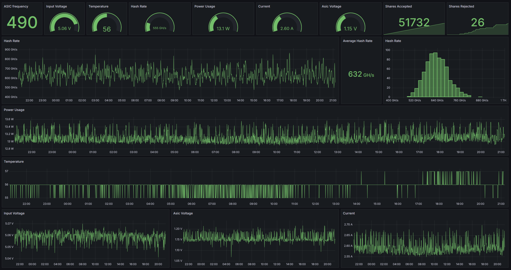

# Setup
This project helps setting up Grafana monitoring for your bitaxe miner.
I will asume you have a basic understanding on Docker/Grafana

We will be using:
- Docker to run our containers 
- Grafana for visualisation
- Prometheus as a Grafana datasourcce
- json-exporter as.. well a json exporter

## Grafana / Prometheus
A basic grafana compose file can be found in [Compose-file](grafana-prometheus-compose.yml)

## json-exporter
https://github.com/prometheus-community/json_exporter
[Compose-file](json-exporter-compose.yml)

## Editing config files
Edit the prometheus.yml to match the IP's of your bitaxe and json-exporter respectively.
In the example compose-file this would be at /etc/prometheus/prometheus.yml

Edit the json-exporter config to add the bitaxe module as shown in [json-exporter-config.yml](json-exporter-config.yml)
In the example compose-file this would be at /root/jsonexporter/config/config.yml

## The dashboard
When Grafana is up and running, import the [dashboardJSON](dashboard.json)
Add the local prometheus instance as a datasource and set it for your bitaxe dashboard
 This example is from a bitaxe Supra