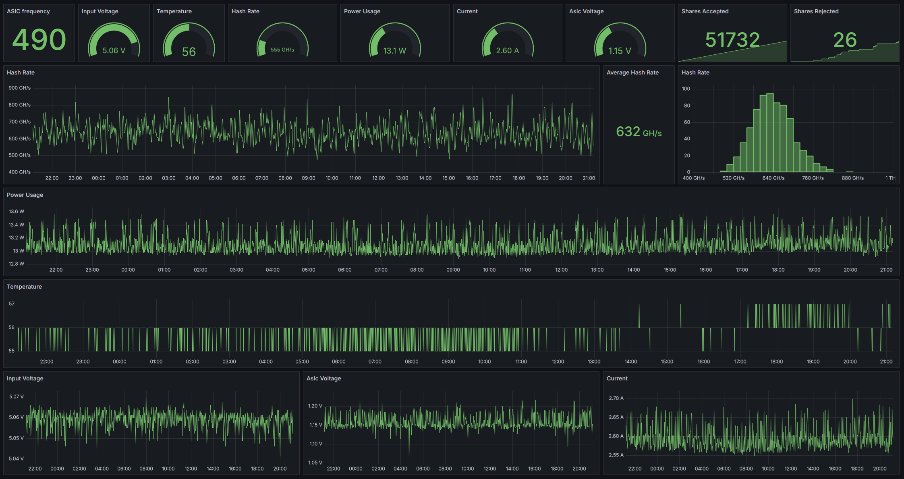

# Setup
This project helps setting up Grafana monitoring for your [bitaxe](https://bitaxe.org/) miner.
I will assume you have a basic understanding on Docker/Grafana

We will be using:
- Docker to run our containers 
- Grafana for visualisation
- Prometheus as a Grafana datasourcce
- json-exporter as.. well a json exporter

## Grafana / Prometheus
A basic Grafana compose file can be found in [Compose-file](grafana-prometheus-compose.yml)

## json-exporter
Link to repo:https://github.com/prometheus-community/json_exporter

[Compose-file](json-exporter-compose.yml)

## Editing config files
Edit the prometheus.yml to match the IP's of your bitaxe and json-exporter respectively.
In the example compose-file this would be at /etc/prometheus/prometheus.yml

In this part you will add all your miners I only have one
````yaml
static_configs:
      - targets:
        - http://10.10.99.1/api/system/info
````

The ip below should be the ip of the json-exporter container
````yaml
- target_label: __address__
        # prometheus-json-exporter endpoint
        replacement: 10.10.40.1:7979
````

Edit the json-exporter config to add the bitaxe module as shown in [json-exporter-config.yml](json-exporter-config.yml)
In the example compose-file this would be at /root/jsonexporter/config/config.yml

## Available Metrics
The json-exporter configuration scrapes the following metrics from the bitaxe `/api/system/info` endpoint:

### Power & Electrical
- `axe_power` - Power consumption in Watts
- `axe_voltage` - Input voltage in Volts
- `axe_current` - Current draw in milliamps
- `axe_asic_core_voltage_setting` - Configured ASIC core voltage
- `axe_asic_core_voltage` - Actual measured ASIC core voltage

### Temperature & Cooling
- `axe_temp` - Average chip temperature in Celsius
- `axe_temp2` - Average chip temperature from second sensor in Celsius
- `axe_vr_temp` - Voltage regulator temperature in Celsius
- `axe_fan_speed_rpm` - Primary fan speed in RPM
- `axe_fan2_speed_rpm` - Secondary fan speed in RPM
- `axe_fan_speed_percent` - Fan speed in percentage
- `axe_overheat_mode` - Overheat protection status

### Performance & Mining
- `axe_hash_rate` - Current hashrate in GH/s
- `axe_hash_rate_1m` - 1-minute average hashrate in GH/s
- `axe_hash_rate_10m` - 10-minute average hashrate in GH/s
- `axe_hash_rate_1h` - 1-hour average hashrate in GH/s
- `axe_expected_hashrate` - Expected hashrate at current voltage/frequency settings in GH/s
- `axe_error_percentage` - Hash error percentage
- `axe_frequency` - ASIC frequency in MHz
- `axe_shares_accepted` - Number of accepted shares
- `axe_shares_rejected` - Number of rejected shares
- `axe_best_difficulty` - Best difficulty achieved
- `axe_best_session_difficulty` - Best difficulty achieved in current session

### Network & Pool
- `axe_stratum_url` - Mining pool stratum URL
- `axe_pool_difficulty` - Current pool difficulty
- `axe_response_time` - Pool response time in milliseconds
- `axe_wifi_status` - WiFi connection status
- `axe_wifi_rssi` - WiFi signal strength in dBm
- `axe_ipv4` - IPv4 address
- `axe_ipv6` - IPv6 address

### Blockchain
- `axe_block_height` - Current block height
- `axe_network_difficulty` - Current Bitcoin network difficulty
- `axe_block_found` - Whether a block was found (0=no, 1=yes)

### System
- `axe_uptime` - System uptime in seconds
- `axe_free_heap` - Free heap memory in Bytes
- `axe_free_heap_internal` - Free internal heap memory in Bytes
- `axe_free_heap_spiram` - Free SPIRAM heap memory in Bytes

## The dashboard
When Grafana is up and running, import the [dashboardJSON](dashboard.json)
Add the local prometheus instance as a datasource and set it for your bitaxe dashboard
 This example is from a bitaxe Supra